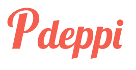

# Pdeppi

En esta situación atípica en la cual nos toca vivir, los pedidos de comida a domicilio aumentaron mucho. Por eso una famosa empresa de delivery, al verse saturada por el aumento de demanda nos pidió ayuda para mejorar su sistema.

----
## Parte A
Nuestra aplicación es básicamente el encuentro entre personas y comidas.
- De cada persona sabemos su nombre, su dirección, su dinero disponible, su comida
favorita y los cupones con los que cuenta.
- De las comidas sabemos su nombre, su costo y los ingredientes que posee.

1. Modelar las **personas**.
2. Modelar las **comidas**.
3. Crear a **Paula**, que vive en Thames al 1585, tiene como comida favorita la hamburguesa deluxe, $3600 en su cuenta y, por ser una usuaria nueva, aún no tiene cupones.
4. Crear la **hamburguesa deluxe**, la cual cuesta $350 y sus ingredientes son: pan, carne, lechuga, tomate, panceta, queso y huevo frito.
5. Create a **vos** (teniendo como mínimo 2 cupones) y a tu comida favorita (si es la hamburguesa deluxe, pone tu segunda favorita).

----
## Parte B
Siendo el principal objetivo de la aplicación la compra de comidas vamos a implementar dos funcionalidades centrales:
1. **comprar**: cuando una persona compra una comida se descuenta el costo de la misma de su dinero disponible (¡ojo! No se puede comprar si no alcanza la plata). Además, si salió menos de $200 se vuelve su nueva comida favorita.
2. **carritoDeCompras**: en nuestra aplicación se pueden comprar muchas comidas al mismo tiempo. Lamentablemente usar este servicio hace que el empaque sea más pesado, por lo que se suma $100 más al total. 

Pero sabemos que ninguna aplicación de delivery es lo mismo sin promociones. Estas aplican ciertas modificaciones a las comidas. ¡Conozcamos algunos de los cupones que ofrecerá Pdeppi!
1. **semanaVegana**: si la comida a comprar es vegana (no contiene carne, huevos o queso entre sus ingredientes) su costo se reduce a la mitad. 
2. **esoNoEsCocaPapi**: algunas personas gustan de acompañar sus comidas con bebidas espirituosas. Dada una bebida, se agregan “Party” al final del nombre de la comida y esta bebida a la lista de ingredientes. El precio, increíblemente, no se ve afectado.
3. **sinTACCis**: a todos los ingredientes les agrega “libre de gluten” al final.
4. **findeVegetariano**: en caso que la comida a comprar no contenga carne, el costo se reduce en un 30%.
5. **largaDistancia**: este cupón es muy útil para las personas que viven lejos. Por solo $50 pesos mas, Pdeppi puede llevar la comida hasta tu casa. Lamentablemente por la lejanía, todos los ingredientes que tienen más de 10 letras se pierden en el camino (_cuantas mas letras tiene el ingrediente, mas pesado es_).
----
## Parte C

Cuando pensábamos que estábamos por terminar, nos piden un par de funcionalidades extra:
1. **comprarConCupones**: nos permite que una persona realice la compra de su
comida favorita aplicándole todos los cupones que tiene a su disposición.
2. **superComida**: dado un conjunto de comidas. Se genera una gran comida, que su
precio es la sumatoria de todos los precios, su nombre es el conjunto de todos los
nombres sacando las vocales y sus ingredientes son todos los ingredientes juntos
sin repetidos.
3. **compraDeluxe**: hace que una persona compre una súper comida creada a partir de
un conjunto de comidas. Para crearla solo se utilizarán aquellas que cuesten menos
de $400, pero duplicándoles el precio.
----
**_Aclaraciones_**
- Todas las funciones deberán estar tipadas.
- NO repetir lógica.
- Usar composición siempre que sea posible.